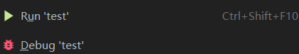
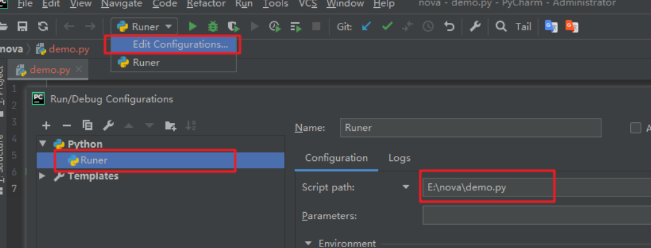
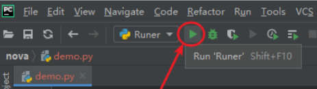

## 1. 【Python 解释器】

> * 设置中搜索“interpreter”

## 2. 【运行 Python 程序】

* **方法1**. 右键 -> 点击 Run 就可以运行该程序
    

* **方法2**
    * 运行过一次该脚本后，PyCharm 就会自动为你记录一次运行记录
        
    
    * 因此以后直接点击这里，就可以直接该程序了
        
        
* **方法3**
    * 如果你在程序里有如下代码
    